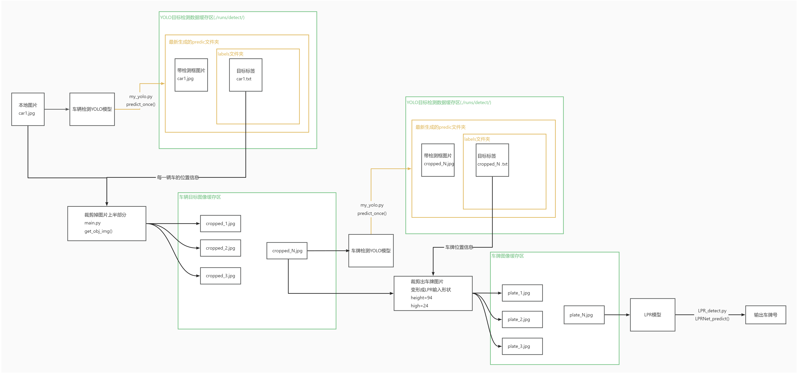
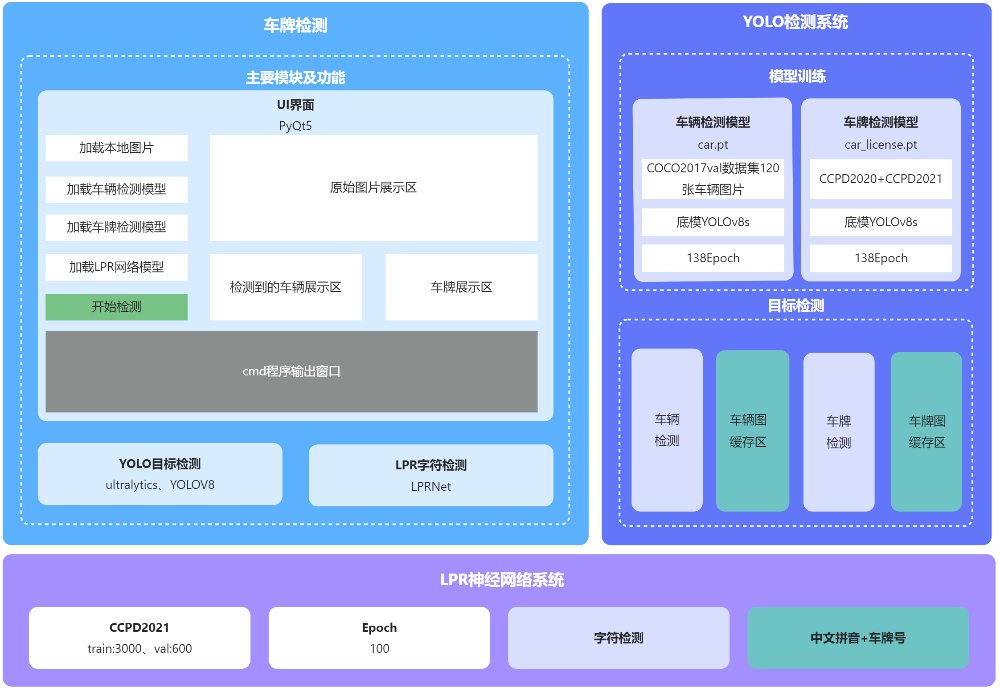
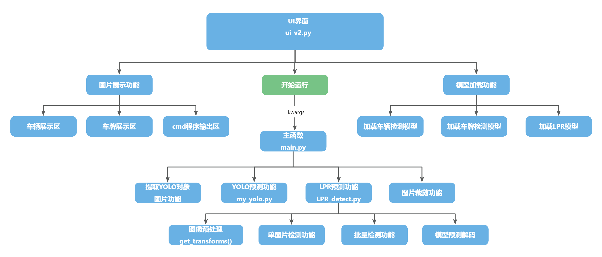

# DoubleYOLO LPR 车牌检测与识别系统

## 项目介绍

这是一个基于 YOLOv8 的双阶段车牌检测与识别系统。系统首先使用 YOLOv8 模型检测车辆和车牌位置，然后使用 LPRNet 模型对车牌图像进行字符识别。支持中国车牌的检测和识别，包括省份简称、字母、数字和特殊字符。

项目结构：
- **YOLO 检测**：使用预训练或自定义 YOLOv8 模型检测车辆和车牌。
- **LPRNet 识别**：基于 CTC 损失的序列识别模型，专为车牌字符设计。
- **UI 支持**：提供简单的 UI 界面（ui_v2.py）进行交互式测试。
- **训练脚本**：支持 LPRNet 的训练和 YOLO 的微调。




## 环境要求

- Python 3.8+
- PyTorch 1.8.0+（支持 CUDA）
- OpenCV 4.5.0+
- Ultralytics YOLOv8

## 安装

1. 克隆仓库：
   ```
   git clone https://github.com/your-repo/DoubleYOLO_LPR_license_plate_detection.git
   cd DoubleYOLO_LPR_license_plate_detection
   ```

2. 安装依赖：
   ```
   pip install -r requirements.txt
   ```

   主要依赖包括：
   - torch >= 1.8.0
   - torchvision >= 0.9.0
   - opencv-python >= 4.5.0
   - ultralytics (YOLOv8)
   - numpy, tqdm, scikit-learn 等

3. （可选）安装 CUDA 支持的 PyTorch 以加速训练。

## 数据准备

### 训练数据组织格式

训练数据应按照以下格式组织：

- **图片文件名即为车牌号码**：例如 `京A12345.jpg`、`沪B67890.jpg`。文件名直接表示车牌内容，用于监督学习。
- **支持的图片格式**：`.jpg`、`.png`、`.jpeg`。
- **建议图片尺寸**：94x24 像素（训练时会自动调整大小）。

### 数据集来源

- **COCO 数据集**（用于 YOLO 车辆检测预训练）：下载地址 [https://cocodataset.org/#download](https://cocodataset.org/#download)。可用于车辆检测的初始训练。
- **CCPD 数据集**（中国车牌数据集）：下载地址 [https://github.com/detectRecog/CCPD](https://github.com/detectRecog/CCPD)。包含大量标注的中国车牌图像，适合 LPRNet 训练。

### 字符集

LPRNet 支持以下字符集（CTC 训练）：

- **省份简称（31个）**：京、沪、津、渝、冀、晋、蒙、辽、吉、黑、苏、浙、皖、闽、赣、鲁、豫、鄂、湘、粤、桂、琼、川、贵、云、藏、陕、甘、青、宁、新
- **数字（10个）**：0-9
- **字母（25个）**：A-Z（除 I、O 外）
- **特殊字符**：- （空白字符，用于 CTC 训练）


## 训练

### 1. YOLO 模型训练（车辆/车牌检测）

使用 `my_yolo.py` 中的 `train_once` 函数。

- 编辑 `YOLOdatasets/YOLO.yaml` 配置数据集路径（train/val 路径，nc=类别数，names=类别名，如 ['vehicle', 'plate']）。
- 运行训练：
  ```
  python -c "from my_yolo import train_once; train_once(model='./yolov8s.pt', data_yaml='./YOLOdatasets/YOLO.yaml', epochs=100, batch=16)"
  ```

  - `model`：初始模型（如 yolov8s.pt）。
  - `data_yaml`：数据集配置文件。
  - `epochs`：训练轮数。
  - 支持恢复训练（resume=True）。

训练输出保存在 `runs/detect/train/`。

### 2. LPRNet 模型训练（车牌识别）

使用 `start_training.py` 启动训练。

1. 准备数据目录（见数据准备）。
2. 配置 `lprr/config.py` 中的路径（TRAIN_DIR, VAL_DIR 等）。
3. 运行：
   ```
   python start_training.py
   ```

   - 支持交互式配置批次大小、轮数、学习率。
   - 或使用 `--auto` 自动训练（默认配置）。
   - 检查环境：`python start_training.py --check-only`。

训练过程：
- 检查环境和数据。
- 创建 checkpoints 和 logs 目录。
- 执行 `lprr/train.py` 训练 LPRNet。
- 模型保存至 `checkpoints/Final_LPRNet_model.pth`。

训练参数示例：
- 批次大小：16-32（视 GPU 内存）
- 轮数：50-100
- 学习率：0.001

## 使用

### 1. 完整车牌检测与识别

运行主脚本：
```
python main.py
```

- 默认使用 `./model/car.pt`（车辆检测）、`./model/car_license.pt`（车牌检测）、`./model/Final_LPRNet_model.pth`（识别）。
- 输入图片：`./test_img/car1.jpg`（可修改 main.py 中的 kwargs）。
- 输出：
  - 车辆裁剪图像保存至 `./car_img_cache/`。
  - 车牌图像保存至 `./plate_img_cache/`。
  - 识别结果打印到控制台。

自定义参数：在 `main.py` 的 `kwargs` 字典中修改模型路径、图片路径、保存目录等。

### 2. 仅 LPRNet 预测

测试单张或目录：
```
python LPR_detect.py --test_dir ./plate_img_cache --model_path ./model/Final_LPRNet_model.pth
```

- `--single_image`：测试单张图片。
- 支持批量测试，输出识别结果和准确率（如果有标签）。

### 3. YOLO 预测

单次预测：
```
python -c "from my_yolo import predict_once; predict_once(model='./model/car.pt', img_path='./test_img/car1.jpg', conf=0.4, detect_classes=[1])"
```

- `detect_classes`：类别 ID（如 [1] 为车辆，[0] 为车牌）。
- 输出保存至 `runs/detect/`。

### 4. UI 界面

运行图形界面：
```
python ui_v2.py
```

提供交互式上传图片和查看结果。

## 模型文件

- **YOLO 模型**：
  - `./model/car.pt`：车辆检测模型。
  - `./model/car_license.pt`：车牌检测模型。
- **LPRNet 模型**：`./model/Final_LPRNet_model.pth`（训练后生成）。

## 其他
https://github.com/mmastererliu/master_liu/tree/master